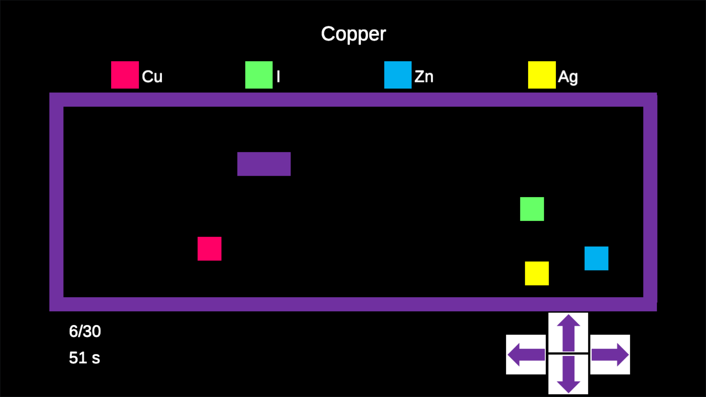

# Chemical Elements - Snake

Chemical Elements - Snake is an engaging and educational chemistry learning game that allows players to practice the names and symbols of chemical elements in 40 different languages. This game is a creative twist on the classic Snake game, combining fun gameplay with valuable learning opportunities.

I recommend checking out another Snake-based chemistry learning game called Snakeleev, as well as the research indicating that it provides significant learning value after just ten minutes of use: Snakeleev: A Gamified Serious Game for Learning the Periodic Table. J. Chem. Educ., 2025, 102 (5), 1814–1828. <a>https://doi.org/10.1021/acs.jchemed.5c00029</a>. Available at: <a>https://github.com/PietroGalizia/Snakeleev</a>

## Game Description

In Chemical Elements - Snake, players navigate a snake on the game field, where four types of food correspond to the symbols of different chemical elements. At the top of the game screen, the name of a chemical element is displayed. The player's objective is to use the arrow keys to guide the snake towards the food that matches the displayed element's chemical symbol.

The game ends if the player collides with the wrong food or the edge of the game area, adding an element of challenge and excitement to the learning experience.

## Features

- Multilingual Learning: Practice the names and symbols of chemical elements in 40 different languages.
- Interactive Gameplay: Navigate the snake to collect the correct food items based on the displayed element name.
- Challenging Mechanics: Avoid collisions with the wrong food and the edges of the game area to keep playing.
- Educational Value: Reinforces knowledge of chemical elements in a fun and engaging way.

## Instructions

- Start the game and choose your preferred language.
- Observe the name of the chemical element displayed at the top of the screen.
- Use the arrow keys to guide the snake towards the food that corresponds to the element's chemical symbol.
- Avoid hitting the wrong food or the edges of the game area to continue playing!

## Screenshots

## Also available for Android devices

